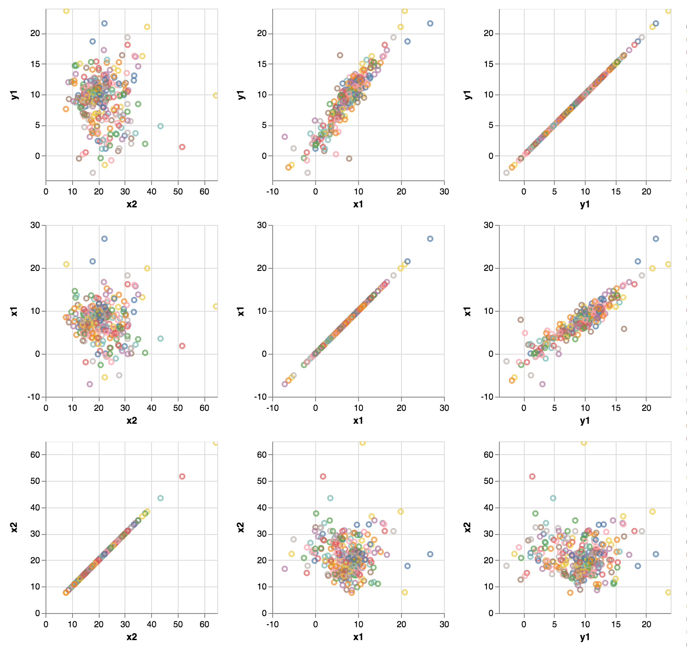

# MapD + Vega [Examples](https://mrblueblue.github.io/mapd-vega-example/public/)

**MapD**

> MapD is a (very fast) in-memory, column store, SQL relational database designed to run on GPUs.

**Vega**
> Vega is a visualization grammar, a declarative language for creating, saving, and sharing interactive visualization designs. 

